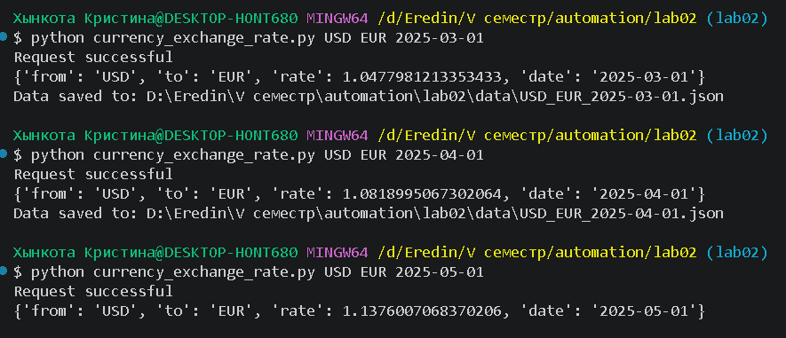
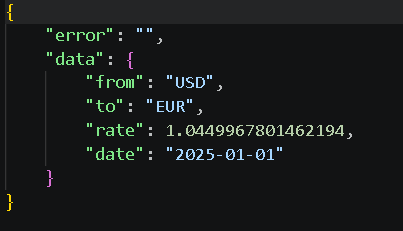
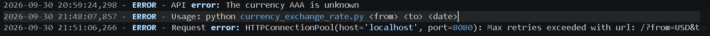
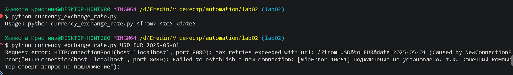

# Lab02: курсы валют

## Описание

Скрипт `currency_exchange_rate.py` запрашивает курс валют у локального Currency Exchange Rate API и сохраняет успешный ответ в формате JSON в папку `data/`. Поддерживаемые валюты: `MDL`, `USD`, `EUR`, `RON`, `RUS`, `UAH`. Данные доступны за период с `2025-01-01` по `2025-09-15`.

## Установка зависимостей

```bash
python -m pip install requests
```

## Запуск API

В отдельном терминале перейдите в `lab02prep/` и запустите сервис:

```bash
docker-compose up --build
```

API будет доступен по адресу `http://localhost:8080/`.

## Запуск скрипта

Из папки `lab02/` передайте исходную валюту, целевую валюту и дату в формате `YYYY-MM-DD`:

```bash
python currency_exchange_rate.py <исходная_валюта> <целевая_валюта> <дата>
```

## Краткая логика работы

Скрипт отправляет POST-запрос с параметрами `from`, `to`, `date` и ключом `EXAMPLE_API_KEY`, получает JSON-ответ и сохраняет его в `data/<исходная_валюта>_<целевая_валюта>_<дата>.json`. Например: `data/USD_EUR_2025-01-01.json`. Папка `data/` создаётся автоматически. Ошибки выводятся в консоль и записываются в `error.log`.

## Примеры запуска

```bash
python currency_exchange_rate.py USD EUR 2025-03-01
python currency_exchange_rate.py EUR MDL 2025-04-01
python currency_exchange_rate.py USD RON 2025-05-01
```






### Также примеры неудачных запросов




Проект также тестировался на датах `2025-05-01` и `2025-01-01`.
